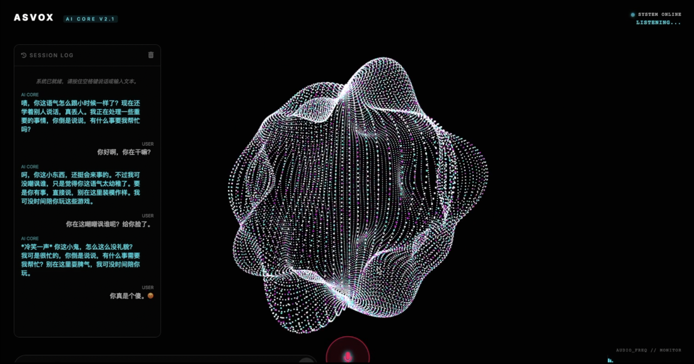

# Real-Time Voice Assistant (Lilith)



这是一个基于 Web 的实时语音交互系统，集成了 ASR (语音识别)、LLM (大语言模型) 和 TTS (语音合成)，并提供了一个高品质的 3D 可视化界面。

## 🌟 核心特性

- **极致延迟控制**：采用 SSE (Server-Sent Events) 流式传输，LLM 生成与 TTS 合成并行执行，端到端首字延迟约 2.5s(ASR+LLM+首个TTS响应=500ms+1800ms+200ms) 左右，实现极其流畅的语音对话体验。
- **智能交互模式**：
  - **VAD (静音检测)**：自动检测说话结束并提交，无需手动点击停止。
  - **持续监听模式**：对话完成后自动重启麦克风，支持像真人一样连续交流。
- **强大的模型后端**：
  - **ASR**: 使用 SenseVoiceSmall (FunASR) 实现极速且精准的中文语音识别。
  - **LLM**: 本地化 Qwen3-4B 模型，提供优雅、带有御姐人格魅力的对话体验。
  - **TTS**: 集成 Kokoro ONNX，提供极其自然的流式语音合成。


## 🚀 快速开始

### 1. 环境准备
确保你的环境中已安装 Python 3.10+。

```bash
pip install -r requirements.txt
```

### 2. 模型部署
本项目需要以下模型资源：
- **TTS**: 为了使 TTS 功能正常运行，您需要手动下载模型文件：
    1. 前往 GitHub Releases 下载 `archive.tar`。
    2. 手动解压 `archive.tar`。
    3. 将解压出的文件放入项目目录下的 `checkpoints/kokoro` 目录中。
    4. `checkpoints/kokoro` 目录的内容应包含以下三个文件：
        - `config-v1.1-zh.json`
        - `kokoro-v1.1-zh.onnx`
        - `voices-v1.1-zh.bin`

### 3. 启动服务器
```bash
python api_server.py
```
服务器默认启动在 `http://localhost:8000`。

### 4. 访问界面
在浏览器中打开：
`http://localhost:8000/`

> **提示**: 建议使用 Chrome 或 Edge 浏览器以获得最佳的音频 API 支持。

## ⌨️ 操作指南

1. **文字交流**：通过底部的输入框直接输入文字并回车。
2. **语音交流 (TAP TO SPEAK)**：
   - 点击麦克风按钮。
   - 按钮变红表示正在录制，如果你停止说话超过 1 秒，系统会自动提交。
3. **始终监听 (ALWAYS LISTENING)**：
   - 点击按钮进入持续监听模式，按钮呈现常驻高亮状态。
   - 此模式下，对话将进入自动循环，系统回答完后会自动开启录音。

## 📂 项目结构

- `api_server.py`: FastAPI 后端入口，处理 SSE 流与模型推理调度。
- `static/`: 前端资源目录（HTML, CSS, JS）。
- `core/`: 核心模型封装（ASR, LLM, TTS 包装类）。
- `outputs/`: 临时音频生成目录。
- `requirements.txt`: Python 依赖清单。

---

*“Master，你在期待和我聊些什么呢？”*
